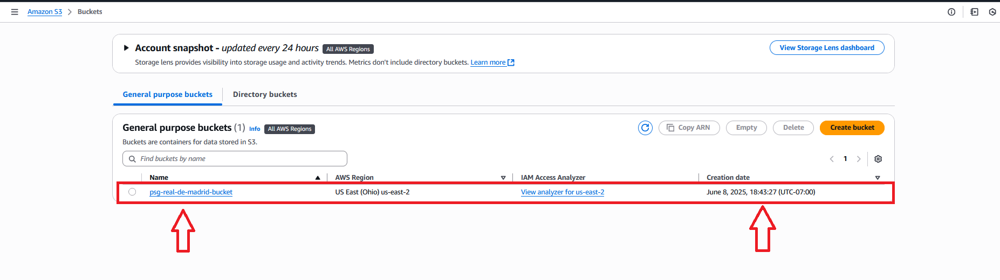
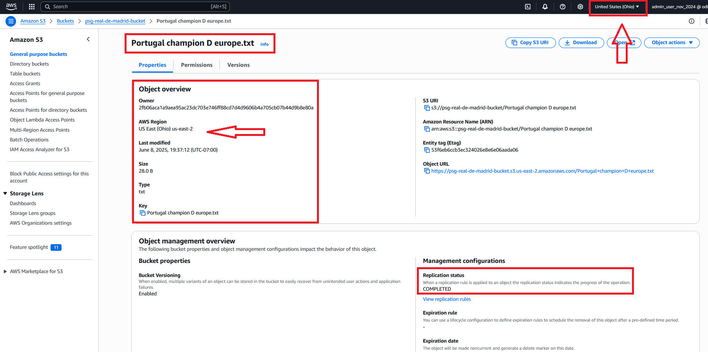

# Projet-Hands-on-S3
In this project, we will create and work with S3 burcket on AWS Cloud


## `Step 1:` Create an S3 bucket in us-east-1 and upload objects in it. 



## `Step 2:` We are creating a cross-region replication in case of Disaster recovery, global performance or back up redundancy. 



CMD ["flask", "run"]
```
## `Step 2:` Build and Run the Application Locally with Docker
Open your terminal, navigate to the root directory of your project, and run the following commands:
### Build the Docker Image
```
docker build -t crypto-app .
```
### Run the Docker Container
```
docker run -d --name crypto-app -p 8080:5000 crypto-app
```
